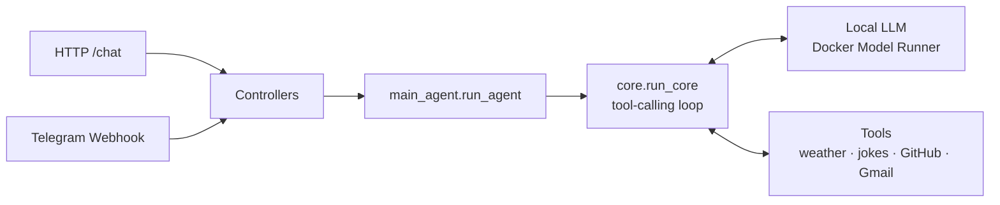

<div align="center">

# 🤖 Personal AI Agent

A self-hosted, tool-using AI agent that runs entirely on your own machine — powered by a local LLM through **Docker Model Runner**, orchestrated with **LangChain**, and served over **FastAPI**.

Talk to it over a simple HTTP endpoint or straight from **Telegram**.


</div>

---

## ✨ Features

- 🧠 **Runs on your own hardware** — no API key or cloud LLM required, thanks to [Docker Model Runner](https://docs.docker.com/desktop/features/model-runner/).
- 🛠️ **Tool-calling agent** — a lightweight, hand-rolled ReAct-style loop that lets the LLM decide when to call a tool and feeds the result back in.
- 💬 **Two entry points** — a REST endpoint (`/chat`) and a Telegram bot webhook, both backed by the same agent.
- 🔌 **Easy to extend** — tools are just plain Python functions with a `@tool` decorator; add one, register it, done.
- 🐘 **Ready for memory/RAG** — ships with a `pgvector`-enabled Postgres container for future long-term memory or retrieval features.

## 🧰 Built-in tools

| Tool | Description |
|---|---|
| ⛅ Weather | Looks up current weather for any city (via Open-Meteo) |
| 😄 Joke Generator | Fetches a random joke |
| 🐙 GitHub | Creates an issue in a given repository |
| ✉️ Gmail | Creates a Gmail draft (never sends automatically) |

## 🏗️ Architecture



Both entry points converge on the same agent core, which binds the available tools to the LLM and loops — invoking the model, dispatching any requested tool calls, and feeding results back — until the model returns a final answer.

## 🚀 Getting started

### Prerequisites

- [Docker](https://www.docker.com/) & Docker Compose
- [Docker Desktop's Model Runner](https://docs.docker.com/desktop/features/model-runner/) with a model downloaded (Models → Docker Hub, pick one that fits your machine)

### 1. Configure environment variables

```bash
cp .env.example .env
```

Fill in the values you need — at minimum the Docker Model Runner settings:

```env
RUNNER_MODEL_BASE_URL=http://host.docker.internal:12434/v1
RUNNER_MODEL=docker.io/ai/qwen3.5:9b-q5_K_M
```

Other variables (Telegram, GitHub, Gmail) are only required for the integrations you plan to use.

### 2. Run it

```bash
docker compose up --build
```

This spins up:
- `app` — the FastAPI server on `http://localhost:8000`
- `postgres` — a `pgvector`-enabled Postgres instance (reserved for future memory/RAG features)

### 3. Talk to it

**Via the REST endpoint:**

```bash
curl -X POST http://localhost:8000/chat \
  -H "Content-Type: application/json" \
  -d '{"query": "What is the weather in Tokyo?"}'
```

**Via Telegram:**

1. Create a bot with [BotFather](https://core.telegram.org/bots#botfather) and grab its token.
2. Set `TELEGRAM_BOT_TOKEN` and `TELEGRAM_API_URL` in `.env`.
3. Point your bot's webhook at `https://<your-host>/webhook/telegram`.
4. Message your bot — replies come back automatically.

## 🧩 Adding a new tool

1. Create `tools/<name>_tool.py`, write a function, and decorate it with `@tool` from `langchain_core.tools`. Give it a clear docstring — that's the only description the model sees.
2. Add any required credentials to `config/settings.py` and `.env.example`.
3. Import the tool and add it to the list passed into `run_core` in `agents/main_agent.py`.

## 📁 Project structure

```
.
├── agents/          # Agent composition + the core tool-calling loop
├── config/          # Environment/config loading, prompts
├── controllers/      # Request handlers for HTTP chat + Telegram webhook
├── tools/           # LangChain-decorated tools the agent can call
├── routes.py        # FastAPI route definitions
├── main.py          # FastAPI app entrypoint
└── docker-compose.yml
```

## 🗺️ Future plans / additions

- 🧠 **RAG implementation** — wire up the `pgvector` Postgres instance ot `Qdrant` for persistent memory and retrieval-augmented generation
- 📝 Populate `config/prompts.py` with configurable, reusable system prompts
- 🔧 Add more tools (calendar, notes, search, etc.)
