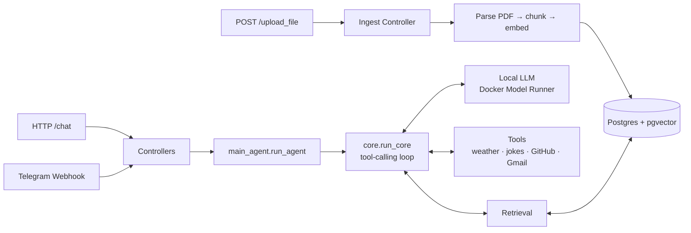

<div align="center">

# 🤖 Personal AI Agent

A self-hosted, tool-using AI agent with document memory (RAG) that runs entirely on your own machine — powered by a local LLM through **Docker Model Runner**, orchestrated with **LangChain**, and served over **FastAPI**.

Talk to it over a simple HTTP endpoint or straight from **Telegram**.


</div>

---

## ✨ Features

- 🧠 **Runs on your own hardware** — no API key or cloud LLM required, thanks to [Docker Model Runner](https://docs.docker.com/desktop/features/model-runner/).
- 🛠️ **Tool-calling agent** — a lightweight, hand-rolled ReAct-style loop that lets the LLM decide when to call a tool and feeds the result back in.
- 📚 **RAG pipeline** — upload a PDF through the API; it is parsed, chunked, embedded and stored in a `pgvector`-enabled Postgres database so the agent can answer from your own documents.
- 💬 **Two entry points** — a REST endpoint (`/chat`) and a Telegram bot webhook, both backed by the same agent.
- 🔌 **Easy to extend** — tools are just plain Python functions with a `@tool` decorator; add one, register it, done.
- 🗃️ **Versioned schema** — database tables are managed with SQLAlchemy and Alembic migrations.

## 🧰 Built-in tools

| Tool | Description |
|---|---|
| ⛅ Weather | Looks up current weather for any city (via Open-Meteo) |
| 😄 Joke Generator | Fetches a random joke |
| 🐙 GitHub | Creates an issue in a given repository |
| ✉️ Gmail | Creates a Gmail draft (never sends automatically) |

## 🏗️ Architecture


```mermaid
flowchart LR
    A[HTTP /chat] --> C[Controllers]
    B[Telegram Webhook] --> C
    U[POST /upload_file] --> IC[Ingest Controller]
    C --> D[main_agent.run_agent]
    D --> E[core.run_core\ntool-calling loop]
    E <--> F[Local LLM\nDocker Model Runner]
    E <--> G[Tools\nweather · jokes · GitHub · Gmail]
    E <--> R[Retrieval]
    IC --> P[Parse PDF → chunk → embed]
    P --> V[(Postgres + pgvector)]
    R <--> V
```

Both chat entry points converge on the same agent core, which binds the available tools to the LLM and loops — invoking the model, dispatching any requested tool calls, and feeding results back — until the model returns a final answer.

### 📚 RAG pipeline

1. **Upload** — send a PDF to `POST /upload_file`.
2. **Parse & chunk** — the text is extracted (`pypdf`) and split into overlapping chunks (`langchain-text-splitters`).
3. **Embed** — each chunk is converted into a vector embedding using `mxbai-embed-large`.
4. **Store** — the file is saved as a `Document` (filename, SHA-256 content hash, raw text) with its `Chunk` rows (text, embedding vector, metadata) in Postgres via the `pgvector` extension. The content hash and filename let ingestion recognise files it has already seen.
5. **Retrieve** — at question time, the query is embedded and `search_chunks_async` (in `db/repository.py`) ranks stored chunks by **cosine distance**, returning the top-k (default 5) along with a similarity score (`1 - distance`). The best matches are given to the LLM as context.

## 🚀 Getting started

### Prerequisites

- [Docker](https://www.docker.com/) & Docker Compose
- [Docker Desktop's Model Runner](https://docs.docker.com/desktop/features/model-runner/) with a chat model **and the `mxbai-embed-large` embedding model** downloaded (Models → Docker Hub, pick a chat model that fits your machine)

### 1. Configure environment variables

```bash
cp .env.example .env
```

Fill in the values you need — at minimum the Docker Model Runner and database settings:

```env
# Docker Model Runner
RUNNER_MODEL_BASE_URL=http://host.docker.internal:12434/v1
RUNNER_MODEL=docker.io/ai/qwen3.5:9b-q5_K_M

# Database (must match the postgres service in docker-compose.yml)
POSTGRES_HOST=postgres
POSTGRES_PORT=5432
POSTGRES_USER=postgres
POSTGRES_PASSWORD=postgres
POSTGRES_DB=ai_agent
```

Other variables (Telegram, GitHub, Gmail) are only required for the integrations you plan to use.

### 2. Run it

```bash
docker compose up --build
```

This spins up:
- `app` — the FastAPI server on `http://localhost:8000`
- `postgres` — a `pgvector/pgvector:pg16` instance that stores your document embeddings (data persists in the `pgdata` volume)

### 3. Run database migrations

```bash
docker compose exec app alembic upgrade head
```

### 4. Talk to it

**Check the server is up:**

```bash
curl http://localhost:8000/health
```

**Via the REST endpoint:**

```bash
curl -X POST http://localhost:8000/chat \
  -H "Content-Type: application/json" \
  -d '{"query": "What is the weather in Tokyo?"}'
```

**Add a document to the agent's memory (RAG):**

```bash
curl -X POST http://localhost:8000/upload_file \
  -F "file=@./my_document.pdf"
```

Then ask about it:

```bash
curl -X POST http://localhost:8000/chat \
  -H "Content-Type: application/json" \
  -d '{"query": "What does my document say about ...?"}'
```

**Via Telegram:**

1. Create a bot with [BotFather](https://core.telegram.org/bots#botfather) and grab its token.
2. Set `TELEGRAM_BOT_TOKEN`, `TELEGRAM_API_URL` and `TELEGRAM_WEBHOOK_SECRET` in `.env`.
3. Point your bot's webhook at `https://<your-host>/webhook/telegram`.
4. Message your bot — replies come back automatically.

## 🔗 API endpoints

| Method | Path | Description |
|---|---|---|
| `GET` | `/` | Basic "server is running" message |
| `GET` | `/health` | Health check |
| `POST` | `/chat` | Send a query to the agent |
| `POST` | `/upload_file` | Upload a PDF (multipart form, field `file`) to ingest into the vector store |
| `POST` | `/webhook/telegram` | Telegram bot webhook |

## 🧩 Adding a new tool

1. Create `tools/<name>_tool.py`, write a function, and decorate it with `@tool` from `langchain_core.tools`. Give it a clear docstring — that's the only description the model sees.
2. Add any required credentials to `config/settings.py` and `.env.example`.
3. Import the tool and add it to the list passed into `run_core` in `agents/main_agent.py`.

## 🗃️ Database migrations

Schema changes are handled with [Alembic](https://alembic.sqlalchemy.org/). After changing a model:

```bash
docker compose exec app alembic revision --autogenerate -m "describe your change"
docker compose exec app alembic upgrade head
```

## 📁 Project structure

```
.
├── agents/          # Agent composition + the core tool-calling loop
├── config/          # Environment/config loading, prompts
├── controllers/     # Request handlers: chat, Telegram webhook, file ingestion
├── db/              # SQLAlchemy models, async session, and repository queries (vector search)
├── migrations/      # Alembic migration scripts
├── services/        # RAG logic (parsing, chunking, embedding, retrieval)
├── tools/           # LangChain-decorated tools the agent can call
├── alembic.ini      # Alembic configuration
├── routes.py        # FastAPI route definitions
├── main.py          # FastAPI app entrypoint
├── Dockerfile
└── docker-compose.yml
```

## 🗺️ Future plans / additions

- 🔎 Improve retrieval quality (re-ranking, hybrid search, metadata filters)
- 📄 Support more document types beyond PDF (docx, markdown, web pages)
- 🧠 Persistent conversation memory alongside document memory
- 📝 Populate `config/prompts.py` with configurable, reusable system prompts
- 🔧 Add more tools (calendar, notes, search, etc.)